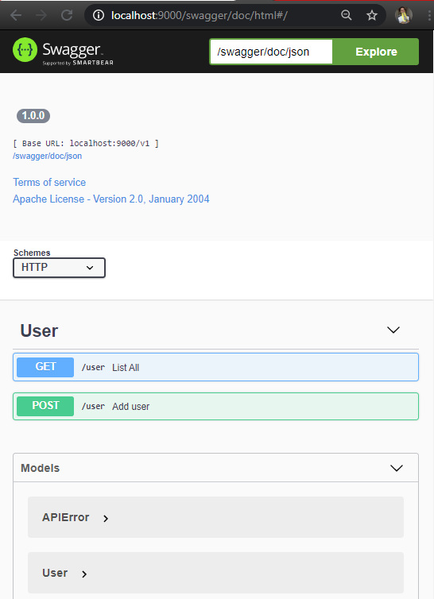

# GBSwagger
Middleware for generate Swagger Document based in your classes using RTTI.

How to use with Horse
```delphi

uses
  Horse,
  Horse.GBSwagger;
  
type
  TUser = class
  private
    Fid: Double;
    Fname: String;
    FlastName: string;
  public
    property id: Double read Fid write Fid;
    property name: String read Fname write Fname;
    property lastName: string read FlastName write FlastName;
  end;

  TAPIError = class
  private
    Ferror: string;
  public
    property error: string read Ferror write Ferror;
  end;
  
var
  APP: THorse;
  
begin
  App := THorse.Create(9000);

  App.Use(HorseSwagger); // Access http://localhost:9000/swagger/doc/html
  
  API.Get ('user', procedure (Req: THorseRequest; Resp: THorseResponse; Next: TProc) begin end);
  API.Post('user', procedure (Req: THorseRequest; Resp: THorseResponse; Next: TProc) begin end);
  
  Swagger
      .BasePath('v1')
      .Path('user')
        .Tag('User')
        .GET('List All', 'List All Users')
          .AddResponse(200, 'successful operation')
            .Schema(TUser)
            .IsArray(True)
          .&End
          .AddResponse(400, 'Bad Request')
            .Schema(TAPIError)
          .&End
          .AddResponse(500, 'Internal Server Error')
            .Schema(TAPIError)
          .&End
        .&End
        .POST('Add user', 'Add a new user')
          .AddParamBody('User data', 'User data')
            .Required(True)
            .Schema(TUser)
          .&End
          .AddResponse(201, 'Created')
            .Schema(TUser)
          .&End
          .AddResponse(400, 'Bad Request')
            .Schema(TAPIError)
          .&End
          .AddResponse(500, 'Internal Server Error')
            .Schema(TAPIError)
          .&End
        .&End
      .&End
    .&End;

  App.Start;
end.
```



## Register
You don't need to write the same error response for many paths, just use a Register interface. 

```delphi
  Swagger
      .Register
        .SchemaOnError(TAPIError)        
      .&End
      .BasePath('v1')
      .Path('user')
        .Tag('User')
        .GET('List All', 'List All Users')
          .AddResponse(200, 'successful operation')
            .Schema(TUser)
            .IsArray(True)
          .&End
          .AddResponse(400).&End
          .AddResponse(500).&End
        .&End
        .POST('Add user', 'Add a new user')
          .AddParamBody('User data', 'User data')
            .Required(True)
            .Schema(TUser)
          .&End
          .AddResponse(201, 'Created')
            .Schema(TUser)
          .&End
          .AddResponse(400).&End
          .AddResponse(500).&End
        .&End
      .&End
    .&End;
```
